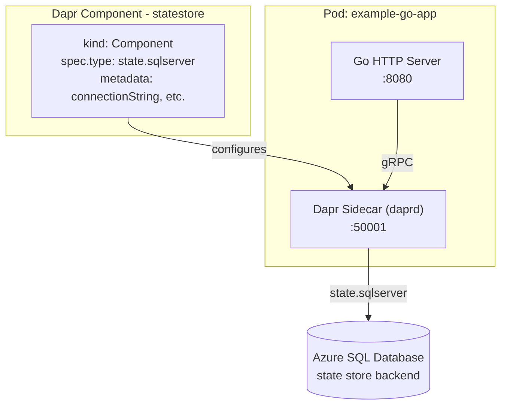
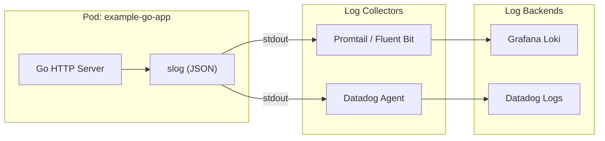
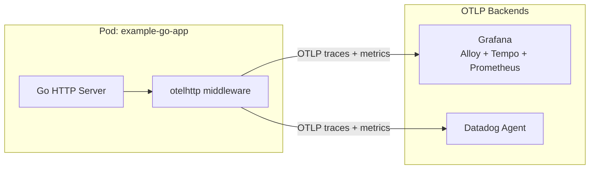
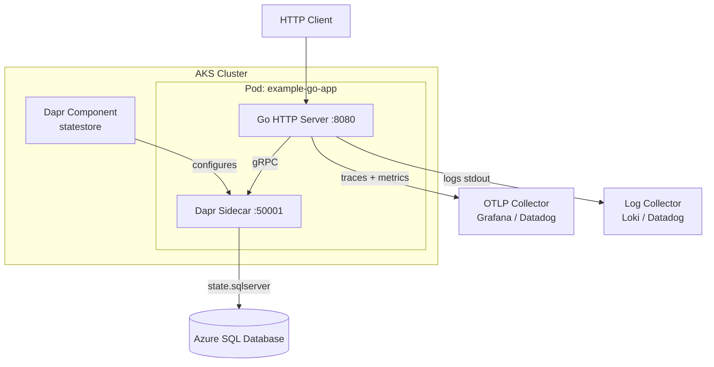

# Architecture

## Application and Dapr State Store

The app uses a **Dapr State Store component** (Kubernetes `Component` resource) to persist state in Azure SQL. The Dapr sidecar reads the component config and connects to Azure SQL; the app never talks to the database directly.

## Observability (Logs, Traces, Metrics)

### Logs

The app uses **slog** and writes JSON logs to stdout. Container logs are collected by a log collector (Promtail, Fluent Bit, Datadog Agent, etc.) and sent to Grafana Loki or Datadog Logs.

### Traces and Metrics (OpenTelemetry)

The app emits **OpenTelemetry** traces and metrics for HTTP requests when `OTEL_EXPORTER_OTLP_ENDPOINT` is set. Data flows to an OTLP-compatible backend (Grafana or Datadog).

## End-to-End Flow

